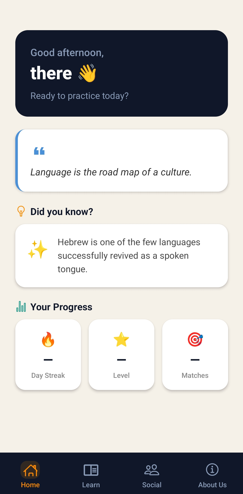
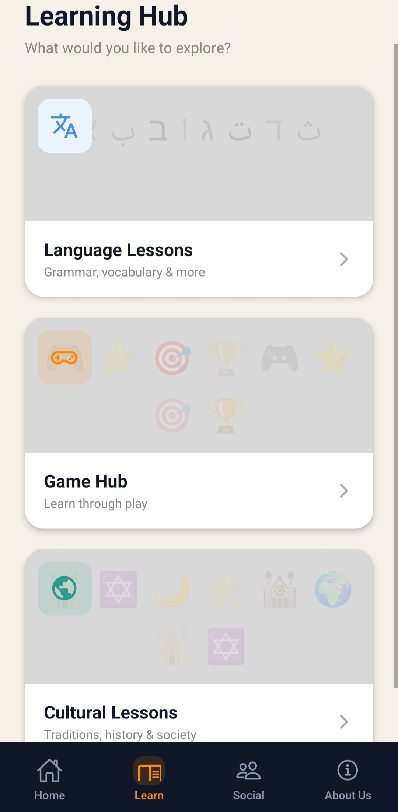
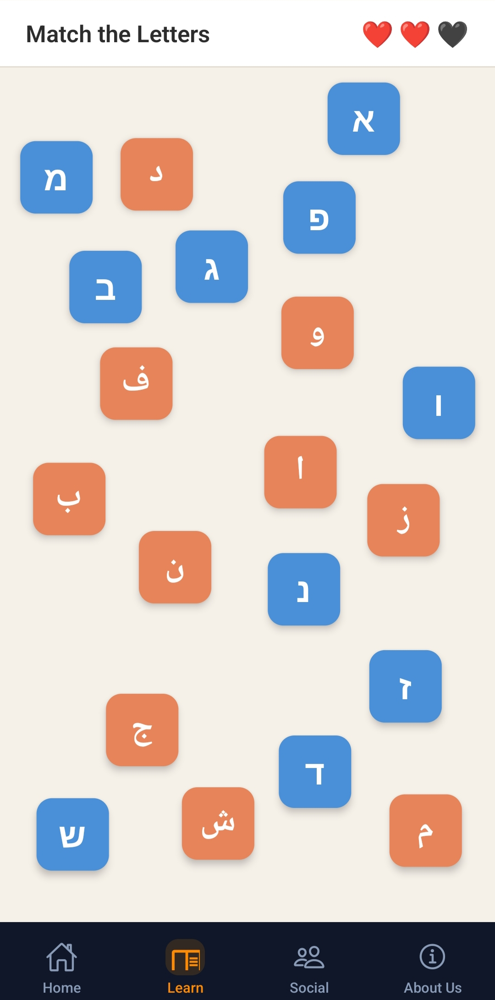
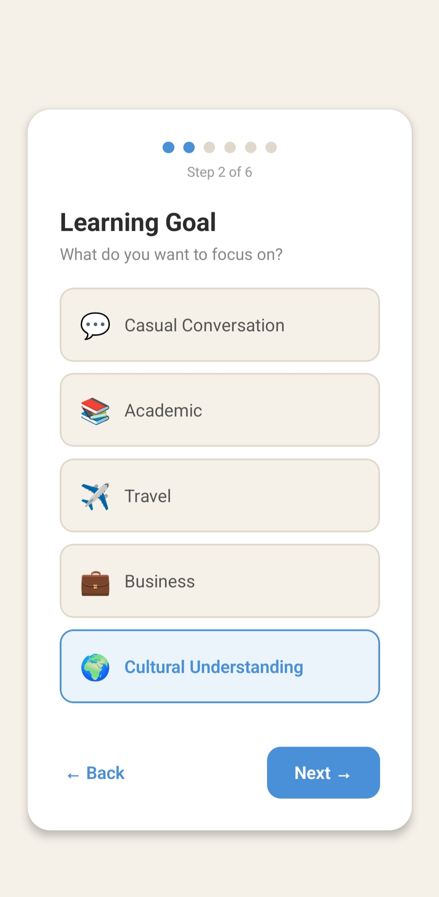
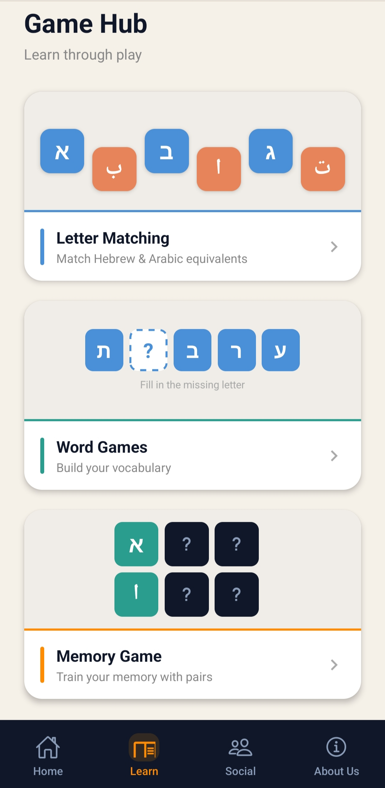
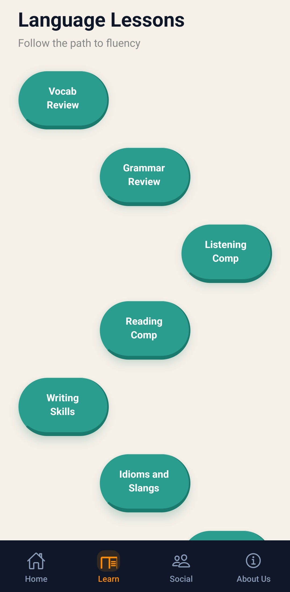

# 🌐 QOL

> A language learning app connecting Hebrew and Arabic speakers through games, lessons, and real human conversation.

[]

---

## 📸 Screenshots

| Home                              | Learning Hub                        | Letter Match Game                    |
| --------------------------------- | ----------------------------------- | ------------------------------------ |
|  |  |  |

| Register                                  | Game Hub                            | Lessons                                 |
| ----------------------------------------- | ----------------------------------- | --------------------------------------- |
|  |  |  |

---

## ✨ Features

- 🎮 **Letter Matching Game** — Drag and drop Hebrew and Arabic equivalent letters to match them, with text-to-speech pronunciation on tap
- 📚 **Learning Hub** — Structured lesson paths for language lessons and cultural content
- 🤝 **Friend Matching** — Get matched with a native speaker of your target language based on shared interests, goals, and proficiency
- 🔐 **Full Auth Flow** — Multi-step onboarding that captures language goals, interests, and profile data
- 💬 **Social Features** — Connect and practice with real people _(in development)_
- 📈 **Progress Tracking** — Level system that grows with your in-app activity

---

## 🧱 Tech Stack

| Layer          | Technology                   |
| -------------- | ---------------------------- |
| Frontend       | React Native + Expo Router   |
| Backend / Auth | Supabase (PostgreSQL + Auth) |
| Realtime       | Supabase Realtime            |
| Text-to-Speech | expo-speech                  |
| Navigation     | Expo Router (file-based)     |
| Icons          | Expo Vector Icons            |

---

## 👥 The Team

| Name             | Role                                   |
| ---------------- | -------------------------------------- |
| **Yoav Lati**    | Developer — Language Learning & Games  |
| **Guy Almog**    | Developer — Matching & Social Features |
| **Rayan Caesar** | Design & UI                            |
| **Chris Khoury** | Ressarch & UX                          |
| **Ghena Saeb**   | Product Manager                        |

---

## 🗺️ Roadmap

- [x] Letter matching game with drag & drop
- [x] Text-to-speech pronunciation
- [x] Multi-step onboarding
- [x] Supabase auth integration
- [x] Learning hub with lesson path
- [x] Game hub with previews
- [ ] Friend matching algorithm
- [ ] In-app chat
- [ ] Text Lessons
- [ ] Word games
- [ ] Memory game
- [ ] Progress tracking & streaks
- [ ] Push notifications

---

## 📄 License

This project is licensed under the MEET License

---

  Built with ❤️ as a mockup startup
   
  

